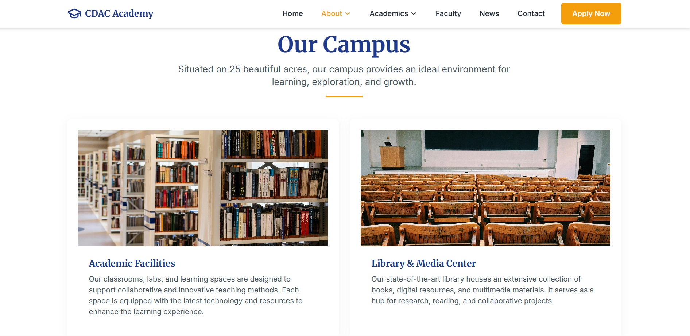
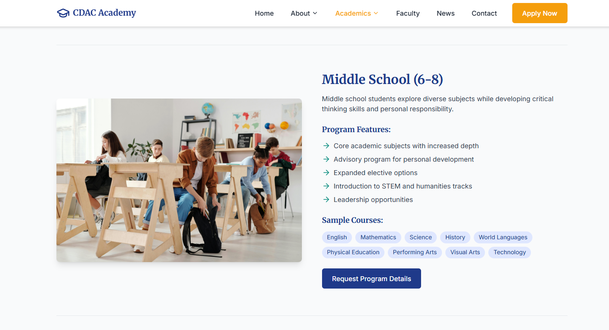
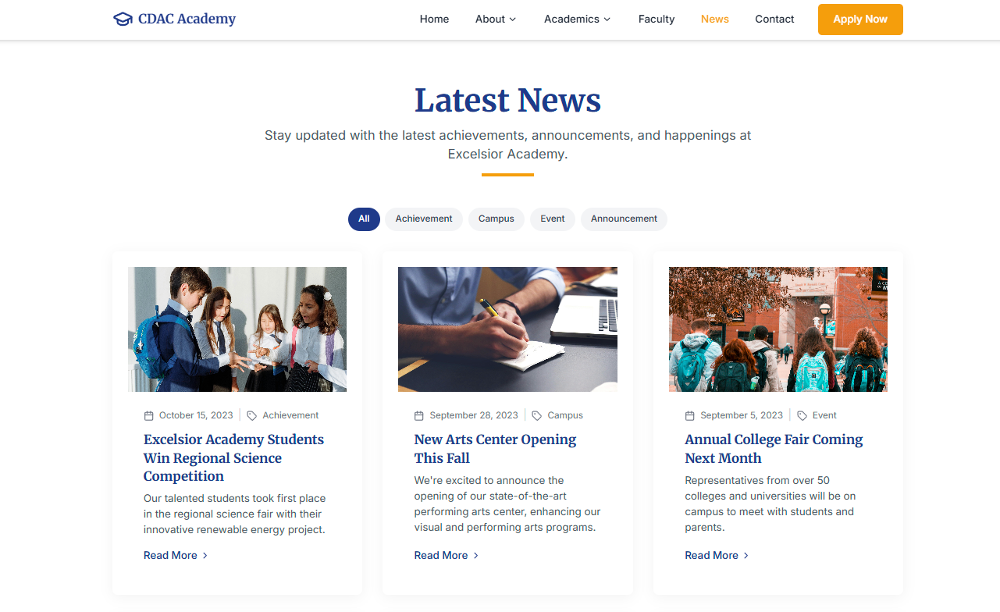
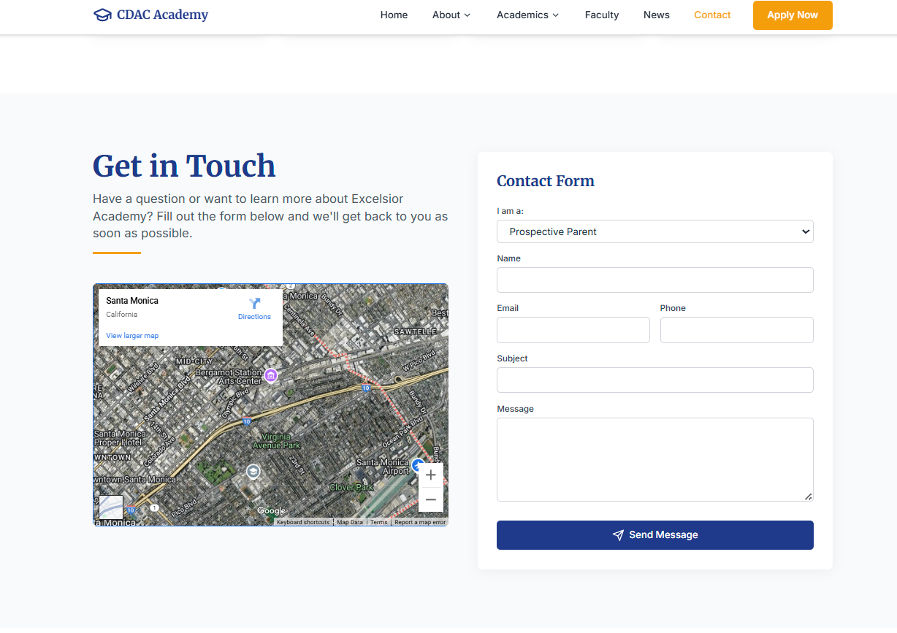

# School website

A modern, responsive school website built with React, TypeScript, and Tailwind CSS. This project showcases a comprehensive educational institution website with beautiful design, smooth animations, and excellent user experience.

## 🌟 Features

### Design & User Experience
- **Modern, Professional Design** - Clean, sophisticated interface with attention to detail
- **Fully Responsive** - Optimized for all devices from mobile to desktop
- **Smooth Animations** - Framer Motion powered animations and micro-interactions
- **Accessibility Focused** - High contrast ratios and semantic HTML structure
- **Performance Optimized** - Fast loading times and efficient code splitting

### Pages & Functionality
- **Homepage** - Hero section, programs overview, testimonials, news & events
- **About Us** - School history, mission & values, campus facilities, leadership team
- **Academics** - Detailed program information, curriculum highlights, educational philosophy
- **Faculty** - Staff directory with search and filter functionality
- **News & Events** - Latest announcements, upcoming events, newsletter subscription
- **Contact** - Contact information, interactive form, campus map, admissions process

### Technical Features
- **React Router** - Client-side routing with smooth page transitions
- **TypeScript** - Type-safe development with excellent IDE support
- **Tailwind CSS** - Utility-first CSS framework for rapid development
- **Framer Motion** - Advanced animations and page transitions
- **Intersection Observer** - Scroll-triggered animations for better engagement
- **Responsive Images** - Optimized images from Pexels for fast loading
- **Form Handling** - Interactive contact forms with validation

## 📸 Screenshots

### 🏠 Homepage

  
> A clean, welcoming landing page showcasing the school’s mission, programs, and call to action.

### 🎓 About Us

  
> Overview of the school’s history, mission, campus features, and leadership.

### 📚 Academics Page

  
> Detailed view of the academic programs, curriculum highlights, and philosophy.

### 👩‍🏫 Faculty Directory

  
> Staff directory with search and filters to explore qualified educators.

### 📰 News & Events

  
> Stay updated with recent announcements and upcoming school activities.

### 📞 Contact Page

  
> Contact details, interactive form, and embedded map for easy outreach.

## 📸 Screenshots

### 🏠 Homepage  
  
> A modern, responsive landing page showcasing the school’s vision, programs, and core highlights.

### 📖 About Page  
  
> Detailed section outlining the school’s history, mission, values, and campus facilities.

### 🎓 Academics Page  
  
> Comprehensive view of the educational programs, curriculum details, and academic philosophy.

### 👩‍🏫 Faculty Page  
  
> Directory of staff members with search/filter functionality to explore faculty profiles.

### 📰 News & Events Page  
  
> Stay updated with the latest announcements, achievements, and upcoming events.

### 📞 Contact Page  
  
> Contact form with map, admission instructions, and school contact details.

---


## 🚀 Quick Start

### Prerequisites
- Node.js (version 16 or higher)
- npm or yarn package manager

### Installation

1. **Clone the repository**
   ```bash
   git clone <repository-url>
   cd excelsior-academy
   ```

2. **Install dependencies**
   ```bash
   npm install
   ```

3. **Start the development server**
   ```bash
   npm run dev
   ```

4. **Open your browser**
   Navigate to `http://localhost:5173` to view the application

### Build for Production

```bash
# Create production build
npm run build

# Preview production build locally
npm run preview
```

## 🛠️ Technology Stack

### Core Technologies
- **React 18** - Modern React with hooks and concurrent features
- **TypeScript** - Static type checking for better code quality
- **Vite** - Fast build tool and development server
- **Tailwind CSS** - Utility-first CSS framework

### Libraries & Tools
- **Framer Motion** - Animation library for React
- **React Router DOM** - Declarative routing for React
- **React Intersection Observer** - React wrapper for Intersection Observer API
- **Lucide React** - Beautiful, customizable SVG icons
- **PostCSS** - CSS post-processor with Autoprefixer

### Development Tools
- **ESLint** - Code linting and formatting
- **TypeScript ESLint** - TypeScript-specific linting rules
- **Vite Plugin React** - Fast refresh and optimizations for React

## 📁 Project Structure

```
src/
├── components/           # Reusable UI components
│   ├── home/            # Homepage-specific components
│   │   ├── Hero.tsx
│   │   ├── About.tsx
│   │   ├── Programs.tsx
│   │   ├── Testimonials.tsx
│   │   ├── NewsEvents.tsx
│   │   └── CallToAction.tsx
│   ├── layout/          # Layout components
│   │   ├── Layout.tsx
│   │   ├── Navbar.tsx
│   │   └── Footer.tsx
│   └── ui/              # Generic UI components
│       ├── AnimatedSection.tsx
│       └── SectionHeading.tsx
├── pages/               # Page components
│   ├── HomePage.tsx
│   ├── AboutPage.tsx
│   ├── AcademicsPage.tsx
│   ├── FacultyPage.tsx
│   ├── NewsPage.tsx
│   └── ContactPage.tsx
├── App.tsx              # Main application component
├── main.tsx             # Application entry point
└── index.css            # Global styles and Tailwind imports
```

## 🎨 Design System

### Color Palette
- **Primary**: Deep blue (#0036B3) for headers and primary actions
- **Secondary**: Bright blue (#1E5EFF) for interactive elements
- **Accent**: Golden yellow (#FFD02C) for highlights and CTAs
- **Neutral**: Comprehensive gray scale for text and backgrounds

### Typography
- **Headings**: Plus Jakarta Sans - Modern, professional font family
- **Body Text**: Inter - Highly readable font optimized for screens
- **Font Weights**: 300, 400, 500, 600, 700, 800

### Spacing System
- **Base Unit**: 8px grid system for consistent spacing
- **Breakpoints**: Mobile-first responsive design
  - `sm`: 640px
  - `md`: 768px
  - `lg`: 1024px
  - `xl`: 1280px

## 🔧 Customization

### Adding New Pages
1. Create a new component in `src/pages/`
2. Add the route to `src/App.tsx`
3. Update navigation in `src/components/layout/Navbar.tsx`

### Modifying Styles
- Global styles: Edit `src/index.css`
- Component styles: Use Tailwind classes or create new components
- Theme customization: Modify `tailwind.config.js`

### Adding Animations
- Use `AnimatedSection` component for scroll-triggered animations
- Import Framer Motion for custom animations
- Follow existing patterns for consistency

## 📱 Responsive Design

The website is fully responsive with carefully crafted breakpoints:

- **Mobile (< 640px)**: Single column layout, touch-friendly navigation
- **Tablet (640px - 1024px)**: Two-column layouts, collapsible navigation
- **Desktop (> 1024px)**: Multi-column layouts, hover effects, full navigation

## ♿ Accessibility

- **Semantic HTML**: Proper heading hierarchy and landmark elements
- **Keyboard Navigation**: Full keyboard accessibility for all interactive elements
- **Screen Reader Support**: ARIA labels and descriptive text
- **Color Contrast**: WCAG AA compliant color combinations
- **Focus Management**: Visible focus indicators and logical tab order

## 🚀 Performance

- **Code Splitting**: Automatic route-based code splitting with React Router
- **Image Optimization**: Responsive images with proper sizing
- **CSS Optimization**: Tailwind CSS purging for minimal bundle size
- **Fast Refresh**: Instant feedback during development with Vite

## 📄 Available Scripts

```bash
# Development
npm run dev          # Start development server
npm run build        # Build for production
npm run preview      # Preview production build
npm run lint         # Run ESLint

# Type Checking
npx tsc --noEmit     # Check TypeScript types
```

## 🤝 Contributing

1. Fork the repository
2. Create a feature branch (`git checkout -b feature/amazing-feature`)
3. Commit your changes (`git commit -m 'Add amazing feature'`)
4. Push to the branch (`git push origin feature/amazing-feature`)
5. Open a Pull Request

### Development Guidelines
- Follow TypeScript best practices
- Use Tailwind CSS for styling
- Maintain responsive design principles
- Add proper TypeScript types for new components
- Test on multiple devices and browsers

## 📝 License

This project is licensed under the MIT License - see the [LICENSE](LICENSE) file for details.

## 🙏 Acknowledgments

- **Images**: High-quality stock photos from [Pexels](https://pexels.com)
- **Icons**: Beautiful icons from [Lucide](https://lucide.dev)
- **Fonts**: Google Fonts (Inter & Plus Jakarta Sans)
- **Inspiration**: Modern educational institution websites

---

